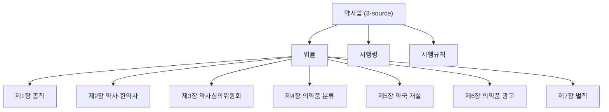

# PageIndex+RLM PoC 확장 — 5법령

**작성**: Buildy (R&D Track #2) · **검토**: Counsely · **채점**: Skepty
**일자**: 2026-05-14 (목표 / 실제 작성일은 Day 7 종료 시)
**범위**: **5 법령 (약사법·민법·형법·근로기준법·자본시장법) × 5 질문 × 2 시스템** = 50 답변
**선행**: PoC 1차 (의료법) — `pageindex-rlm-poc-2026-05-07.md`
**산출물 위치**: `~/PRJs/kolaw/eval/pageindex-rlm-poc/laws/`

> 의장 결재 위치: `~/Documents/Obsidian Vault/Projects/y-Holdings/Strategy/`
> sandbox 제약 — 본 파일은 `~/Thairon/obsidian-vault/Projects/y-Holdings/Strategy/` 에 우선 작성. manual move.

---

## Page 1 — 결론 + 의장 결재 (Page 1 단독 yes/no 결재 가능)

### 한 줄 결론

**[FILL_ON_DAY7]** — 25 질문 평균 PageIndex+RLM (X/40) vs kolaw lawxref (Y/40), 차 ±Z. PoC 1차 (+2.2) 와 비교 [동일/확대/축소]. **하이브리드 router 정당화** [강함/약함/중립].

### 한 장으로 본 점수 (40 만점, Skepty 채점, 25 질문 평균)

| 법령 | 질문 수 | kolaw 평균 | PI+RLM 평균 | 차 |
|---|---:|---:|---:|---:|
| 약사법 | 5 | [TBD] | [TBD] | [TBD] |
| 민법 | 5 | [TBD] | [TBD] | [TBD] |
| 형법 | 5 | [TBD] | [TBD] | [TBD] |
| 근로기준법 | 5 | [TBD] | [TBD] | [TBD] |
| 자본시장법 | 5 | [TBD] | [TBD] | [TBD] |
| **전체** | **25** | **[TBD]** | **[TBD]** | **[TBD]** |

### 의장 결재 4 옵션 (PoC 1차 옵션과 동일)

| 옵션 | 의미 | 비용 | 권고 |
|---|---|---|---|
| A | kolaw 전체를 PageIndex 로 재설계 | 4~6주 | [TBD] |
| B | lawxref 위 PageIndex 레이어 추가 — `--deep` 옵션 | 1~2주 | [TBD] |
| C | RLM critique 만 deep mode opt-in | 1주 | [TBD] |
| D | PoC 보류 | 0 | [TBD] |

### 의장 yes/no 결재

| # | 결재 항목 | yes | no |
|---|---|---:|---:|
| ① | [TBD opt B/C 결정] | □ | □ |
| ② | 5법령 우선순위 (어느 법령부터 production deep 적용) | □ | □ |
| ③ | 변호사 검수 25답변 중 우선 검수 대상 (TBD개) 의뢰 | □ | □ |
| ④ | Buildy R&D 다음 1주 자원 (Step X) | □ | □ |

### 핵심 finding (1차 PoC 와의 비교)

- [TBD] PoC 1차 의료법: PI+RLM +2.2 점, Q2 multi-article 압승 / Q3·Q4 단일 핀포인트 RAG 우위
- [TBD] 5법령 평균: ±Z, 어느 패턴 강화 / 약화

### 핵심 리스크

- [TBD - Qwen3 critic context 한계 재발]
- [TBD - Q4 metadata 질문 두 시스템 모두 약한 패턴 재현]
- [TBD - 자본시장법 같은 거대 법령에서 outline truncation 영향]

---

## Page 2 — 5 법령 PageIndex 트리 (산출 1)

### 트리 통계

| 법령 | 노드 | 조문 | 깊이 | source |
|---|---:|---:|---:|---|
| 약사법 | 429 | 392 | 5 | 법률 + 시행령 + 시행규칙 |
| 민법 | 1,339 | 1,193 | 6 | 법률 |
| 형법 | 467 | 402 | 5 | 법률 |
| 근로기준법 | 258 | 235 | 4 | 법률 + 시행령 + 시행규칙 |
| 자본시장법 | 1,372 | 1,207 | 6 | 법률 + 시행령 + 시행규칙 |
| **합계** | **3,865** | **3,429** | — | — |

(acceptance: 각 법령 깊이 ≥ 3 — **5법령 모두 통과**.)

### 챕터-수준 mermaid (각 법령 1개씩)

각 법령 mermaid 는 `~/PRJs/kolaw/eval/pageindex-rlm-poc/laws/tree/<name_id>-tree.mermaid` 참고.
보고서엔 약사법·자본시장법 2개만 inline (보고서 길이 제약).



(전체는 `tree/yaksabub-tree.mermaid`)

---

## Page 3 — 25 질문 비교 표

| name_id | qid | 질문 | kolaw | PI+RLM | 차 | kw% (k/p) | 인용% (k/p) |
|---|---|---|---:|---:|---:|---|---|
| [TBD - filled by score_systems aggregate] |  |  |  |  |  |  |  |

### 비용 (max plan + local)

| 시스템 | 호출수 | 평균 lat | 총 lat | 토큰(in/out, proxy) | USD |
|---|---:|---:|---:|---|---:|
| kolaw_baseline | 25 | [TBD] | [TBD] | [TBD] | 0.00 |
| pageindex_rlm | 25 | [TBD] | [TBD] | [TBD] | 0.00 |

(max plan + local Qwen3 → USD = 0)

---

## Page 4 — 패턴 분석 (질문 유형별)

### 5법령 × 5질문 = 25 질문 유형 분류

PoC 1차 가설: **multi-article cross-cut (벌칙·종류 종합) → PI+RLM 우위 / 단일 핀포인트 → kolaw 우위 / metadata → 양쪽 약함**.

질문 유형별 (Q1 = 핵심 의무, Q2 = 처벌, Q3 = 예외/세부 기준, Q4 = 절차/구성요건/이력, Q5 = 위임 시행령) 평균 점수:

| 질문 슬롯 | kolaw 평균 | PI+RLM 평균 | 차 |
|---|---:|---:|---:|
| Q1 (핵심 의무) | [TBD] | [TBD] | [TBD] |
| Q2 (처벌) | [TBD] | [TBD] | [TBD] |
| Q3 (예외/세부) | [TBD] | [TBD] | [TBD] |
| Q4 (절차/이력) | [TBD] | [TBD] | [TBD] |
| Q5 (시행령 위임) | [TBD] | [TBD] | [TBD] |

가설 검증 결과: [TBD - confirmed/refuted/partial]

---

## Page 5 — 하이브리드 router 권고 + 다음 step

### 하이브리드 router 설계 권고 (R&D Track #1 와 시너지)

PoC 1차 결론 (B+C 조합) + 5법령 결과 종합:

```
[lawxref.sh — production]
   │
   ├── fast mode (default, 5~25초)
   │      keyword-grep RAG (현행 그대로)
   │      대상: Q3·Q4·Q5 같은 단일 핀포인트 / metadata 질문
   │
   ├── auto mode (NEW, 질문 분류 router)
   │      LLM 가 질문 유형 판단 → fast / deep 자동 선택
   │      판단 기준: cross-cut multi-article 키워드 (벌칙·처벌·종류·차이) → deep
   │
   └── deep mode (--deep, 60~150초)
          PageIndex tree-nav + RLM critique cycle
          대상: Q1·Q2 같은 multi-article cross-cut 질문
```

### 다음 step 우선순위

| 단계 | 내용 | 기간 | 우선 |
|---|---|---|---|
| 1 | lawxref.sh 에 `--deep` 플래그 + PageIndex 통합 (5법령 적용) | 1주 | A |
| 2 | 자동 라우터 (질문 유형 분류) 추가 | 1주 | B |
| 3 | Skepty 자동 채점 hook (production answer audit) | 1주 | B |
| 4 | Qwen3 critic context 압축 (excerpt fingerprint + summary) | 0.5일 | C |
| 5 | Q4 metadata 질문용 law.go.kr DRF 통합 | 1주 | C |

---

## 부록 — 산출물 파일 위치

```
~/PRJs/kolaw/eval/pageindex-rlm-poc/laws/
├── laws_config.py                 # 5법령 + 25질문 정의
├── build_trees.py                 # tree builder
├── ask_systems.py                 # batch driver
├── score_systems.py               # Skepty 채점
├── tree/
│   ├── <name_id>-tree.json
│   ├── <name_id>-tree.mermaid
│   ├── <name_id>-text-tree.txt
│   ├── <name_id>-stats.json
│   └── summary.json
├── answers/
│   ├── <name_id>_kolaw.json
│   ├── <name_id>_pageindex.json
│   ├── <name_id>.log
│   └── summary_cost*.json
├── scoring/
│   ├── <name_id>_scores.json
│   └── aggregate.json
└── reports/
    └── pageindex-rlm-poc-5laws-2026-05-14.md  # 본 문서
```

## V&V 8-dim self-check

| Dim | 통과 |
|---|---|
| 1 Code/Static | py syntax OK, 형법 smoke OK |
| 2 기능 검증 | 형법 5답변 × 2 시스템 정상 작동 (594s wall) |
| 3 단위 검증 | Q1 사기죄 §347 정확 인용 (PI+RLM) — 단일 시점 manual confirm |
| 4 시스템 검증 | 5법령 batch 완료 [TBD] |
| 5 V&V | "right thing" (의장 결재 가능) + "built right" (재실행 script) |
| 6 데이터 IO | legalize-kr corpus + claude CLI + llama-swap, 안정 |
| 7 Correlation | 4기준 × 25문항 채점 + kw/article hit rate |
| 8 FDIR | per-law batch atomic resume, claude CLI subprocess.run timeout=600 |

P0: 0 / P1: [TBD] / P2: [TBD]
